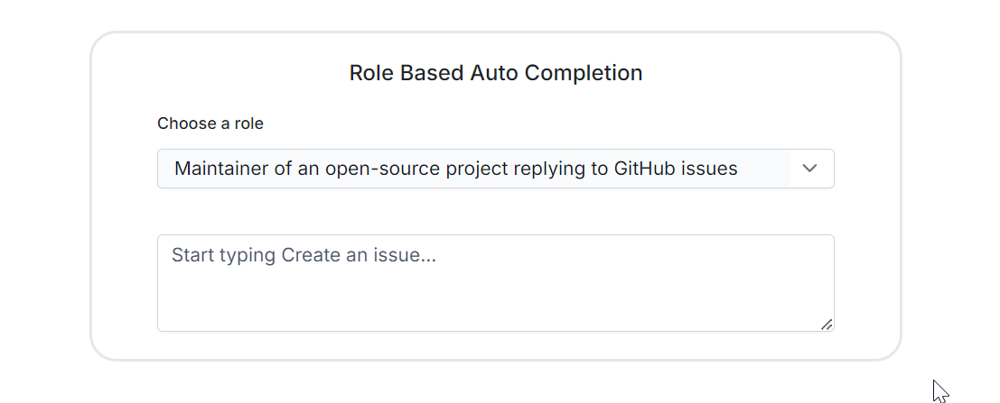
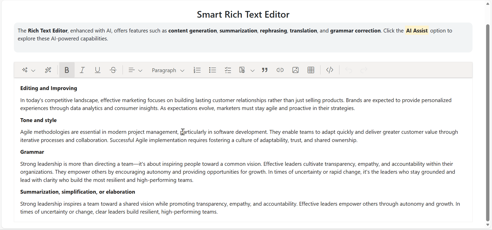

# AI Syncfusion Samples Repository

This repository contains all AI-related Syncfusion samples organized in a separate repository. It includes various components and functionalities that leverage AI technologies to enhance Syncfusion controls.

## Controls and Dependencies

### OpenAI Dependencies
All AI samples rely on OpenAI/Azure OpenAI services. Ensure you have the necessary API keys and configuration settings to run these samples.

## Configuration Instructions

Follow the instructions below to register an AI model in your application.

### OpenAI

For **OpenAI**, create an API key and place it at `openAIApiKey`. The value for `openAIModel` is the model you wish to use (e.g., `gpt-3.5-turbo`, `gpt-4`, etc.).

* Install the following NuGet packages to your project:

```

Install-Package Microsoft.Extensions.AI
Install-Package Microsoft.Extensions.AI.OpenAI

```

* To configure the AI service, add the following settings to the **~/Program.cs** file in your Blazor Server app.

```cs

using Syncfusion.Blazor.SmartComponents;
using Syncfusion.Blazor.AI;
using Microsoft.Extensions.AI;
using OpenAI;
var builder = WebApplication.CreateBuilder(args);

....

builder.Services.AddSyncfusionBlazor();

string openAIApiKey = "API-KEY";
string openAIModel = "OPENAI_MODEL";
OpenAIClient openAIClient = new OpenAIClient(openAIApiKey);
IChatClient openAIChatClient = openAIClient.GetChatClient(openAIModel).AsIChatClient();
builder.Services.AddChatClient(openAIChatClient);

builder.Services.AddSyncfusionSmartComponents()
.InjectOpenAIInference();

var app = builder.Build();
....

```

### Azure OpenAI

For **Azure OpenAI**, first [deploy an Azure OpenAI Service resource and model](https://learn.microsoft.com/en-us/azure/ai-services/openai/how-to/create-resource), then values for `azureOpenAIKey`, `azureOpenAIEndpoint` and `azureOpenAIModel` will all be provided to you.

* Install the following NuGet packages to your project:

```cs

Install-Package Microsoft.Extensions.AI
Install-Package Microsoft.Extensions.AI.OpenAI
Install-Package Azure.AI.OpenAI

```

* To configure the AI service, add the following settings to the **~/Program.cs** file in your Blazor Server app.

```cs

using Syncfusion.Blazor.SmartComponents;
using Syncfusion.Blazor.AI;
using Azure.AI.OpenAI;
using Microsoft.Extensions.AI;
using System.ClientModel;

var builder = WebApplication.CreateBuilder(args);

....

builder.Services.AddSyncfusionBlazor();

string azureOpenAIKey = "AZURE_OPENAI_KEY";
string azureOpenAIEndpoint = "AZURE_OPENAI_ENDPOINT";
string azureOpenAIModel = "AZURE_OPENAI_MODEL";
AzureOpenAIClient azureOpenAIClient = new AzureOpenAIClient(
     new Uri(azureOpenAIEndpoint),
     new ApiKeyCredential(azureOpenAIKey)
);
IChatClient azureOpenAIChatClient = azureOpenAIClient.GetChatClient(azureOpenAIModel).AsIChatClient();
builder.Services.AddChatClient(azureOpenAIChatClient);

builder.Services.AddSyncfusionSmartComponents()
.InjectOpenAIInference();

var app = builder.Build();
....

```

### Ollama

To use Ollama for running self-hosted models:

1. **Download and install Ollama**  
   Visit [Ollama's official website](https://ollama.com) and install the application appropriate for your operating system.

2. **Install the desired model from the Ollama library**  
   You can browse and install models from the [Ollama Library](https://ollama.com/library) (e.g., `llama2:13b`, `mistral:7b`, etc.).

3. **Configure your application**

   - Provide the `Endpoint` URL where the model is hosted (e.g., `http://localhost:11434`).
   - Set `ModelName` to the specific model you installed (e.g., `llama2:13b`).

* Install the following NuGet packages to your project:

```
Install-Package Microsoft.Extensions.AI
Install-Package OllamaSharp 
```

* Add the following settings to the **~/Program.cs** file in your Blazor Server app.

```cs

using Syncfusion.Blazor.SmartComponents;
using Syncfusion.Blazor.AI;
using Microsoft.Extensions.AI;
using OllamaSharp;

var builder = WebApplication.CreateBuilder(args);

....

builder.Services.AddSyncfusionBlazor();

string ModelName = "MODEL_NAME";
IChatClient chatClient = new OllamaApiClient("http://localhost:11434", ModelName);
builder.Services.AddChatClient(chatClient);

builder.Services.AddSyncfusionSmartComponents()
.InjectOpenAIInference();

var app = builder.Build();
....

```

## Smart Controls

### Smart Paste Button

The **ejs-smartpaste** is an advanced AI control built on top of Syncfusion's Button control. It inherits all the robust features and functionalities of the standard Syncfusion Button control while introducing an innovative intelligent pasting capability. This UI control leverages AI to intelligently paste clipboard data, ensuring that the pasted content is contextually relevant and formatted correctly.


By integrating the capabilities of AI, the `ejs-smartpaste` goes beyond simple data insertion. It ensures that pasted content is contextually relevant and is ideal for applications where users frequently copy and paste data.

### Smart TextArea

The **ejs-smarttextarea** is an AI-powered enhancement to the traditional textarea, offering sentence-level autocompletion based on its configuration and user input, improving typing speed and efficiency.




## Smart AI Solutions

### Rich Text Editor

The **Syncfusion Asp.Net Core Rich Text Editor** now features advanced AI-powered samples that enhance content creation and editing. This integration provides users with powerful tools for rephrasing, grammar correction, summarization, elaboration, translation, and sentiment analysis, making the writing process more efficient and intuitive.



