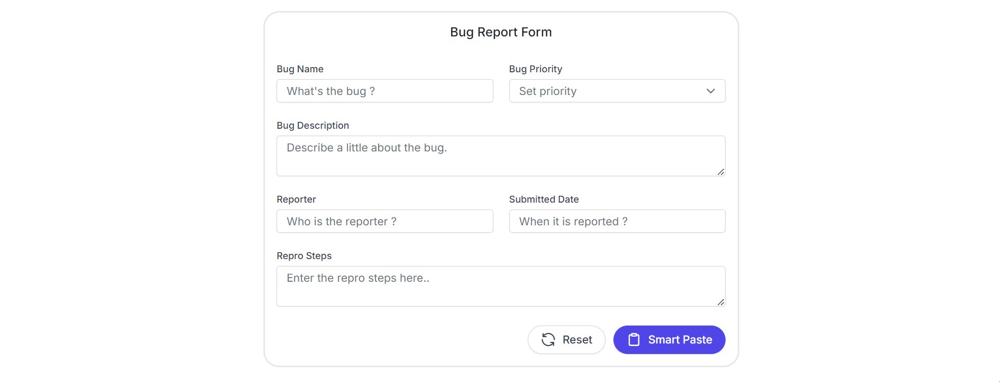
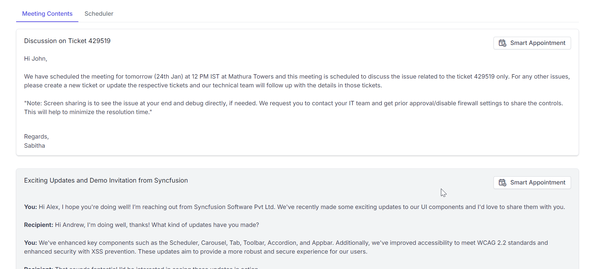
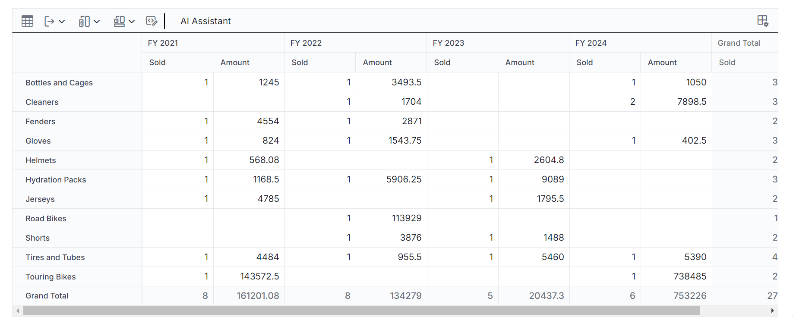
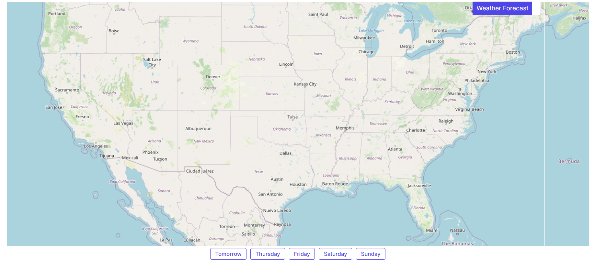
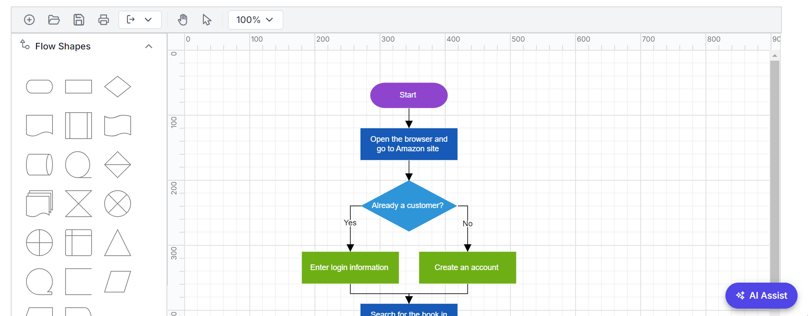
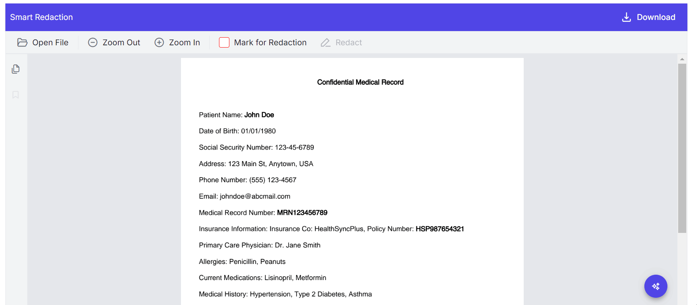
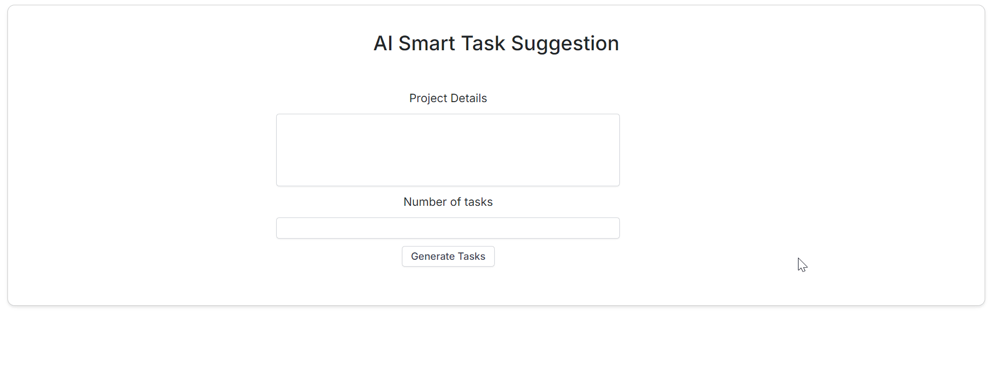
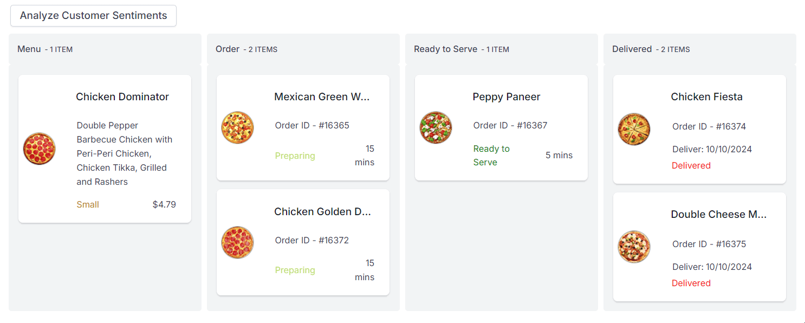
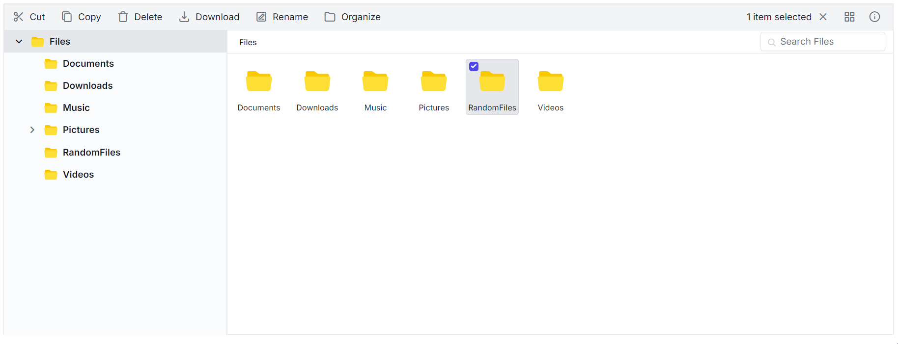
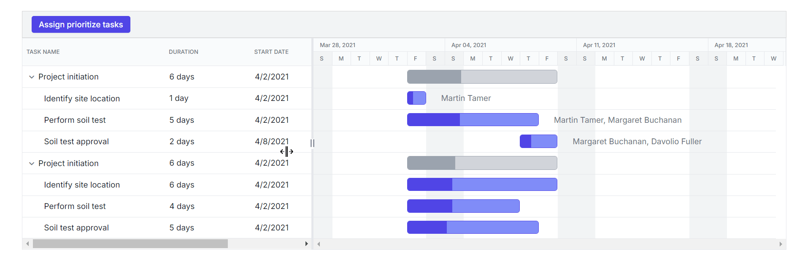

# AI Syncfusion Samples Repository

This repository contains all AI-related Syncfusion samples organized in a separate repository. It includes various components and functionalities that leverage AI technologies to enhance Syncfusion components.

## Components and Dependencies

### Local Embeddings
The following samples use MSDN smart component's [local embeddings](https://www.nuget.org/packages/SmartComponents.LocalEmbeddings/0.1.0-preview10148) and do not require Azure OpenAI:
- **DataGrid (Semantic Filtering)**
- **ComboBox (Embeddings)**
- **FileManager (Tag Searching)**

### Stability AI
Image Editor AI samples rely on third party [Stability AI](https://stability.ai/) service.

### OpenAI Dependencies
All other component samples rely on OpenAI/Azure OpenAI services. Ensure you have the necessary API keys and configuration settings to run these samples.

## Configuration Instructions

### Configuring AI Service Credentials
To run AI samples, navigate to the `Program.cs` file and replace the following placeholders with your actual credentials:

#### Azure OpenAI

```
string apiKey = "your-api-key";
string deploymentName = "your-deployment-name";
string endpoint = "your-azure-endpoint-url";
```

Your azure Endpoint would look something like this
`https://{resource_name}.openai.azure.com/`

To use Azure OpenAI, please install the [Azure.AI.OpenAI](https://www.nuget.org/packages/Azure.AI.OpenAI) package separately in the Blazor application.

#### OpenAI

If you are using **OpenAI**, [create an API key](https://help.openai.com/en/articles/4936850-where-do-i-find-my-openai-api-key) and place it at `apiKey`, leave the `endpoint` as `""`. The value for `deploymentName` is the [model](https://platform.openai.com/docs/models/) you wish to use (e.g., `gpt-3.5-turbo`, `gpt-4`, etc.).

## Configuring Image Editor AI
The Image Editor AI depends on a third-party AI service called Stability AI for AI Image processing. To use it, follow these steps:

- You may obtain your API key from [Stability AI](https://platform.stability.ai/account/keys).
- Navigate to `SmartImageEditor.razor` file under `Pages/ImageEditor` folder and replace the placeholder with actual API_KEY:

```cs
// Stability AI APIKEY
public string ApiKey = "your-api-key";

```

Once configured everything, hit `Run` and you're good to go!

## Smart Components

### Smart Paste Button

The **SfSmartPasteButton** is an advanced AI component built on top of Syncfusion's Button component. It inherits all the robust features and functionalities of the standard Syncfusion Button component while introducing an innovative intelligent pasting capability. This component leverages AI to intelligently paste clipboard data, ensuring that the pasted content is contextually relevant and formatted correctly.



By integrating the capabilities of AI, the `SfSmartPasteButton` goes beyond simple data insertion. It ensures that pasted content is contextually relevant and is ideal for applications where users frequently copy and paste data.

For more insights, refer [here](SyncfusionAISamples/Components/Pages/SmartPaste/Readme.md).

### Smart TextArea

The **SfSmartTextArea** is an AI-powered enhancement to the traditional textarea, offering sentence-level autocompletion based on its configuration and user input, improving typing speed and efficiency.


For more insights, refer [here](SyncfusionAISamples/Components/Pages/SmartTextArea/Readme.md).

## Smart AI Solutions

### Combo Box

The **Syncfusion Blazor ComboBox** now includes an advanced Semantic Search feature, designed to enhance search functionality by understanding the meaning behind user queries, not just keywords. This results in more accurate and intuitive search outcomes, especially in applications with large or complex datasets.

For more insights, refer [here](SyncfusionAISamples/Components/Pages/ComboBox/Readme.md).

### Scheduler

The **Syncfusion Blazor Scheduler** now features advanced AI capabilities that transform natural language text into structured scheduler events. This integration enhances user experience by allowing casual text input to be seamlessly converted into meeting appointments, making scheduling more efficient and intuitive.



For more insights, refer [here](SyncfusionAISamples/Components/Pages/Scheduler/Readme.md).

### Rich Text Editor

The **Syncfusion Blazor Rich Text Editor** now features advanced AI-powered samples that enhance content creation and editing. This integration provides users with powerful tools for rephrasing, grammar correction, summarization, elaboration, translation, and sentiment analysis, making the writing process more efficient and intuitive.


For more insights, refer [here](SyncfusionAISamples/Components/Pages/RichTextEditor/Readme.md).

### Pivot Table

The **Syncfusion Blazor Pivot Table** now features advanced AI capabilities that transform the way users visualize and analyze data. This integration empowers users to dynamically explore and extract insights from complex datasets with ease. Key functionalities include **Smart Data Aggregation** for automatic data consolidation, **Predictive Modeling** to identify trends and patterns, and **Adaptive Filtering** to ensure only relevant data is displayed.



For more insights, refer [here](SyncfusionAISamples/Components/Pages/PivotTable/Readme.md).

### TreeGrid

The **Syncfusion Blazor Tree Grid** leverages AI to enhance the structuring and correction of hierarchical data, ensuring accurate parent-child relationships. This demo highlights AI's ability to automatically organize and display complex datasets, making it easier to visualize structured data in the Tree Grid component.


For more insights, refer [here](SyncfusionAISamples/Components/Pages/TreeGrid/Readme.md).

### QueryBuilder

The **Syncfusion Blazor Query Builder** now features **Natural Language Querying**, allowing users to construct complex queries effortlessly using plain, everyday language. Instead of navigating technical query syntax, users can type their questions as they naturally would, making data retrieval accessible to everyone, regardless of technical expertise.


For more insights, refer [here](SyncfusionAISamples/Components/Pages/QueryBuilder/Readme.md).

### Maps

The **Syncfusion Blazor Maps** component features a robust **Weather Forecast** integration, leveraging AI to provide accurate weather predictions. These forecasts are visualized using marker templates within the map, allowing users to easily access real-time weather information.

#### Weather Forecast



For more insights, refer [here](SyncfusionAISamples/Components/Pages/Maps/Readme.md).

### Diagram

The **Syncfusion Blazor Diagram Component** introduces AI-powered samples like **MindMap** and **FlowChart** generation, allowing users to visualize ideas, processes, and workflows dynamically. These tools are ideal for brainstorming sessions, decision-making processes, and organizing complex information into structured formats.

#### MindMap



#### FlowChart


For more insights, refer [here](SyncfusionAISamples/Components/Pages/Diagram/Readme.md).

### PDF Viewer

The **Syncfusion Blazor PDF Viewer** now incorporates advanced AI features, enhancing the document handling experience. This includes functionalities such as **Smart Fill** for automatic form filling, **Document Summarization** for efficient content understanding, and **Smart Redaction** for protecting sensitive information.

#### Smart Fill


#### Smart Redaction



#### Document Summarization


For more insights, refer [here](SyncfusionAISamples/Components/Pages/PDFViewer/Readme.md).

### Document Editor

The **Syncfusion Blazor Document Editor** features advanced AI capabilities, including **Document Summarization**, **Smart Editor** enhancements, and **Writing Assist** for improved content creation and editing. These features streamline document management, enhance writing quality, and support efficient content generation, making the editing process more intuitive and productive.

#### Document Summarization


#### Smart Editor


#### Writing Assist


For more insights, refer [here](SyncfusionAISamples/Components/Pages/DocumentEditor/Readme.md).

### Kanban

The **Syncfusion Blazor Kanban** component features advanced AI integrations that enhance project management capabilities. With **AI Task Recommendation**, users can input project details to automatically generate task segments, facilitating smoother project planning and organization. Additionally, the **Sentiment Analysis** feature analyzes customer feedback to generate emoticon expressions, visually representing customer sentiments on the Kanban board.

#### AI Task Recommendation



#### Sentiment Analysis


For more insights, refer [here](SyncfusionAISamples/Components/Pages/Kanban/Readme.md).

### File Manager

The **Syncfusion Blazor File Manager** introduces AI-powered samples like **Smart File Management** and **Tag Search** to streamline file organization and retrieval. With capabilities such as Smart Search, Content Summarization, and AI-assisted tagging, managing files becomes more intuitive and efficient.

#### Smart File Management



For more insights, refer [here](SyncfusionAISamples/Components/Pages/FileManager/Readme.md).

### DataGrid

The **Syncfusion Blazor DataGrid** now includes advanced AI Samples like **Semantic Filtering** and **Anomaly Detection**. These features empower users to search more effectively and detect irregularities within data, making the DataGrid a powerful tool for applications that handle large datasets or require insights into complex data patterns.

#### Anomaly Detection


For more insights, refer [here](SyncfusionAISamples/Components/Pages/DataGrid/Readme.md).

### Gantt Chart

The **Syncfusion Blazor GanttChart** introduces powerful AI-driven samples designed to enhance task management and project planning. Key functionalities include **Task Prioritization** to identify and allocate resources to critical tasks, **Progress Prediction** for forecasting milestone completions, **Resource Allocation** to prevent overallocation, **Risk Assessment** to identify potential risks in project timelines, and **Predictive Scheduling** for creating task schedules based on historical data. These features work together to streamline project execution, ensuring efficient resource management and timely completion.

#### Task Prioritization



#### Progress Prediction


#### Resource Allocation


#### Risk Assessment


#### Predictive Scheduling


For more insights, refer [here](SyncfusionAISamples/Components/Pages/GanttChart/Readme.md).

### Image Editor

The **Syncfusion Blazor Image Editor** offers an sample **Smart Image Editor** with powerful features designed to enhance your image editing experience. Key functionalities include the **Magic Eraser** for removing unwanted elements seamlessly, the **Background Changer** for creatively altering backgrounds while maintaining the integrity of the main subject, and the **Background Remover** for isolating subjects to create transparent or customized backdrops. 

#### Smart Image Editor


For more insights, refer [here](SyncfusionAISamples/Components/Pages/ImageEditor/Readme.md).

## Project Documentation

This table provides an overview of all the AI Samples in this project, along with links to their respective README files for detailed documentation.

<table>
    <thead>
        <tr>
            <th>Section</th>
            <th>Component / Feature</th>
            <th>Description</th>
            <th>Documentation Link</th>
        </tr>
    </thead>
    <tbody>
        <tr>
            <td rowspan="2"><strong>Smart Paste Button</strong></td>
            <td>Smart Paste Functionality</td>
            <td>Automatically fills out forms using clipboard data, improving data entry efficiency.</td>
            <td><a href="SyncfusionAISamples/Components/Pages/SmartPaste/Readme.md">Read More</a></td>
        </tr>
        <tr>
            <td>Custom Field Descriptions</td>
            <td>Uses the data-smartpaste-description attribute to improve Smart Paste accuracy by customizing field descriptions for better data population.</td>
            <td><a href="SyncfusionAISamples/Components/Pages/SmartPaste/Readme.md">Read More</a></td>
        </tr>
        <tr>
            <td><strong>Smart TextArea</strong></td>
            <td>Sentence-Level Autocompletion</td>
            <td>Provides real-time sentence suggestions based on user input, enhancing typing efficiency with AI.</td>
            <td><a href="SyncfusionAISamples/Components/Pages/SmartTextArea/Readme.md">Read More</a></td>
        </tr>
        <tr>
            <td><strong>ComboBox</strong></td>
            <td>Semantic Search</td>
            <td>Advanced search capabilities using context and meaning rather than exact keywords.</td>
            <td><a href="SyncfusionAISamples/Components/Pages/ComboBox/Readme.md">Read More</a></td>
        </tr>
        <tr>
            <td rowspan="2"><strong>Data Grid</strong></td>
            <td>Semantic Filtering</td>
            <td>Filters data semantically.</td>
            <td><a href="SyncfusionAISamples/Components/Pages/DataGrid/Readme.md">Read More</a></td>
        </tr>
        <tr>
            <td>Anomaly Detection</td>
            <td>Detects anomalies in datasets.</td>
            <td><a href="SyncfusionAISamples/Components/Pages/DataGrid/Readme.md">Read More</a></td>
        </tr>
        <tr>
            <td><strong>Scheduler</strong></td>
            <td>Smart Scheduler</td>
            <td>Converts natural language text into scheduler events, adding them as structured appointments.</td>
            <td><a href="SyncfusionAISamples/Components/Pages/Scheduler/Readme.md">Read More</a></td>
        </tr>
        <tr>
            <td rowspan="5"><strong>Gantt</strong></td>
            <td>Task Prioritize</td>
            <td>AI-based task prioritization tool.</td>
            <td><a href="SyncfusionAISamples/Components/Pages/GanttChart/Readme.md">Read More</a></td>
        </tr>
        <tr>
            <td>Progress Predictor</td>
            <td>Predicts project progress and completion.</td>
            <td><a href="SyncfusionAISamples/Components/Pages/GanttChart/Readme.md">Read More</a></td>
        </tr>
        <tr>
            <td>Resource Allocator</td>
            <td>Optimizes resource allocation.</td>
            <td><a href="SyncfusionAISamples/Components/Pages/GanttChart/Readme.md">Read More</a></td>
        </tr>
        <tr>
            <td>Risk Assessor</td>
            <td>Assesses project risks using AI.</td>
            <td><a href="SyncfusionAISamples/Components/Pages/GanttChart/Readme.md">Read More</a></td>
        </tr>
        <tr>
            <td>Predictive Scheduling</td>
            <td>AI-driven project scheduling.</td>
            <td><a href="SyncfusionAISamples/Components/Pages/GanttChart/Readme.md">Read More</a></td>
        </tr>
        <tr>
            <td><strong>RichTextEditor</strong></td>
            <td>AI Integration</td>
            <td>Enhances text editing with features like content generation, summarization, rephrasing, translation, and grammar correction.</td>
            <td><a href="SyncfusionAISamples/Components/Pages/RichTextEditor/Readme.md">Read More</a></td>
        </tr>
        <tr>
            <td rowspan="2"><strong>Kanban Board</strong></td>
            <td>AI Task Recommendation</td>
            <td>Recommends tasks based on AI analysis.</td>
            <td><a href="SyncfusionAISamples/Components/Pages/Kanban/Readme.md">Read More</a></td>
        </tr>
        <tr>
            <td>Sentiment Analysis</td>
            <td>Analyzes customer feedback sentiments.</td>
            <td><a href="SyncfusionAISamples/Components/Pages/Kanban/Readme.md">Read More</a></td>
        </tr>
        <tr>
            <td><strong>Image Editor</strong></td>
            <td>AI Image Editing</td>
            <td>Advanced image editing features including Magic Eraser, Background Changer, and Background Remover for enhanced creativity and precision.</td>
            <td><a href="SyncfusionAISamples/Components/Pages/ImageEditor/Readme.md">Read More</a></td>
        </tr>
        <tr>
            <td rowspan="2"><strong>Diagram</strong></td>
            <td>TextToMindMap</td>
            <td>Creates dynamic mindmaps using AI-generated content.</td>
            <td><a href="SyncfusionAISamples/Components/Pages/Diagram/Readme.md">Read More</a></td>
        </tr>
        <tr>
            <td>TextToFlowChart</td>
            <td>Creates flowcharts based on AI-generated workflows.</td>
            <td><a href="SyncfusionAISamples/Components/Pages/Diagram/Readme.md">Read More</a></td>
        </tr>
        <tr>
            <td rowspan="3"><strong>PDF Viewer</strong></td>
            <td>Document Summarization</td>
            <td>Summarizes documents using AI.</td>
            <td><a href="SyncfusionAISamples/Components/Pages/PDFViewer/Readme.md">Read More</a></td>
        </tr>
        <tr>
            <td>Smart Redaction</td>
            <td>Redacts sensitive information intelligently.</td>
            <td><a href="SyncfusionAISamples/Components/Pages/PDFViewer/Readme.md">Read More</a></td>
        </tr>
        <tr>
            <td>Smart Fill</td>
            <td>Automatically fills forms with AI.</td>
            <td><a href="SyncfusionAISamples/Components/Pages/PDFViewer/Readme.md">Read More</a></td>
        </tr>
        <tr>
            <td rowspan="3"><strong>Document Editor</strong></td>
            <td>Document Summarization</td>
            <td>AI-driven summarization and Q&A for document content.</td>
            <td><a href="SyncfusionAISamples/Components/Pages/DocumentEditor/Readme.md">Read More</a></td>
        </tr>
        <tr>
            <td>Smart Editor</td>
            <td>Enhances document editing with rewriting, grammar checking, and translation.</td>
            <td><a href="SyncfusionAISamples/Components/Pages/DocumentEditor/Readme.md">Read More</a></td>
        </tr>
        <tr>
            <td>Writing Assist</td>
            <td>Generates new content based on user input and assists in expanding ideas.</td>
            <td><a href="SyncfusionAISamples/Components/Pages/DocumentEditor/Readme.md">Read More</a></td>
        </tr>
        <tr>
            <td><strong>Maps</strong></td>
            <td>Weather Forecast</td>
            <td>Displays weather forecasts on a map.</td>
            <td><a href="SyncfusionAISamples/Components/Pages/Maps/Readme.md">Read More</a></td>
        </tr>
        <tr>
            <td rowspan="2"><strong>File Manager</strong></td>
            <td>Smart File Manager</td>
            <td>AI-driven features like Smart Search, Content Summary, and Intelligent Organization.</td>
            <td><a href="SyncfusionAISamples/Components/Pages/FileManager/Readme.md">Read More</a></td>
        </tr>
        <tr>
            <td>Tag Search</td>
            <td>AI Tagging and Tag Search capabilities for better file categorization and retrieval.</td>
            <td><a href="SyncfusionAISamples/Components/Pages/FileManager/Readme.md">Read More</a></td>
        </tr>
        <tr>
            <td><strong>Pivot Table</strong></td>
            <td>AI Data Analysis</td>
            <td>AI integration for smart data aggregation, predictive modeling, adaptive filtering, and real-time interaction, enhancing data analysis and visualization.</td>
            <td><a href="SyncfusionAISamples/Components/Pages/PivotTable/Readme.md">Read More</a></td>
        </tr>
        <tr>
            <td><strong>Query Builder</strong></td>
            <td>Natural Language Querying</td>
            <td>Allows users to build queries in plain language, with the system interpreting the intent and generating the appropriate query.</td>
            <td><a href="SyncfusionAISamples/Components/Pages/QueryBuilder/Readme.md">Read More</a></td>
        </tr>
        <tr>
            <td><strong>TreeGrid</strong></td>
            <td>Hierarchical Data Structuring</td>
            <td>Uses AI to correct and organize hierarchical data in a Tree Grid, fixing parent-child relationships to ensure accurate data nesting.</td>
            <td><a href="SyncfusionAISamples/Components/Pages/TreeGrid/Readme.md">Read More</a></td>
        </tr>
    </tbody>
</table>
